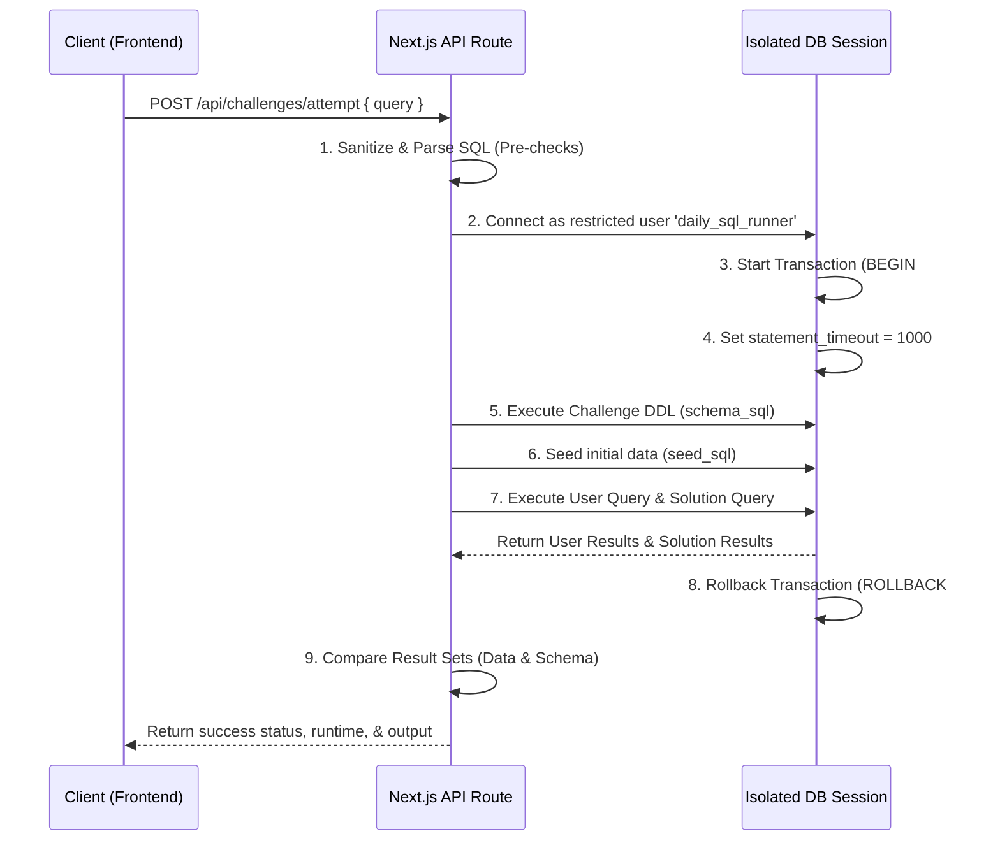

# Query Execution & Sandbox Design

To ensure DailySQL can securely execute arbitrary SQL queries submitted by users, we utilize a multi-layered sandboxing and validation architecture.

---

## 1. Sandbox Architecture Flow

The execution cycle ensures that user-defined SQL queries cannot compromise the integrity of the application database, access other users' data, or tie up server resources.



---

## 2. PostgreSQL Isolation & Security Strategy

### 2.1. Restricted Runner Role
User queries run under a dedicated Database user (`daily_sql_runner`) configured with minimum permissions:
- Revoke all default privileges on public schemas.
- Prevent connection to any database except the isolated query execution database.
- Disable access to superuser/admin functions and administrative catalog tables (e.g. `pg_authid`, `pg_shadow`).

### 2.2. Transaction-Based Rollback (Standard MVP Sandbox)
To avoid spinup delays associated with creating database containers or physical databases per request, each execution is isolated using PostgreSQL's transaction boundaries:
1. Open a connection from the runner pool.
2. Issue a `BEGIN;` statement to mark the transaction boundary.
3. Configure session-level limits:
   ```sql
   SET LOCAL statement_timeout = 1000;  -- Max 1 second execution
   SET LOCAL work_mem = '32MB';         -- Limit sort/hash memory
   ```
4. Run schema DDL (e.g., `CREATE TABLE users (...)`) and seed commands (`INSERT INTO users ...`).
5. Run the user's query and capture the output.
6. Issue a `ROLLBACK;` statement. This instantly and completely purges the table structures, schemas, and seeds generated during this session, leaving the host database completely clean.

---

## 3. SQL Sanitization & Pre-Checks

Before submitting the SQL query to the database, a backend middleware performs sanitization checks:
1. **Keyword Blacklist**: Reject queries containing forbidden system or administrative commands:
   - `ALTER`, `DROP`, `CREATE USER`, `GRANT`, `REVOKE`
   - `pg_sleep`, `pg_read_file`, `pg_write_file`, `copy`
   - `vacuum`, `analyze`
2. **Single Statement Enforcement**: Ensure only a single query statement is executed by blocking multiple statements (e.g., rejecting queries containing unquoted semicolons `;` followed by additional commands).

---

## 4. Validation & Comparison Algorithm

To verify correctness, the execution engine compares the result of the user's query with the result of the official `solution_sql` run against the exact same seed data.

### 4.1. Structure Verification
- **Column Count**: Must match exactly.
- **Column Names**: Column names (or aliases) must match the expected solution output.
- **Column Types**: The returned types must be compatible with the solution types.

### 4.2. Data Verification
- **Sorted vs. Unsorted Comparison**:
  - If the challenge description or expected solution requires a specific ordering (e.g., has `ORDER BY`), verification compares the rows as an ordered list (strict index-to-index matching).
  - If no specific order is requested, row verification compares the sets (independent of sorting order).
- **Exact Matches**: Values are checked for type-sensitive equality (e.g., matching timestamps, numeric scale, string casing).
